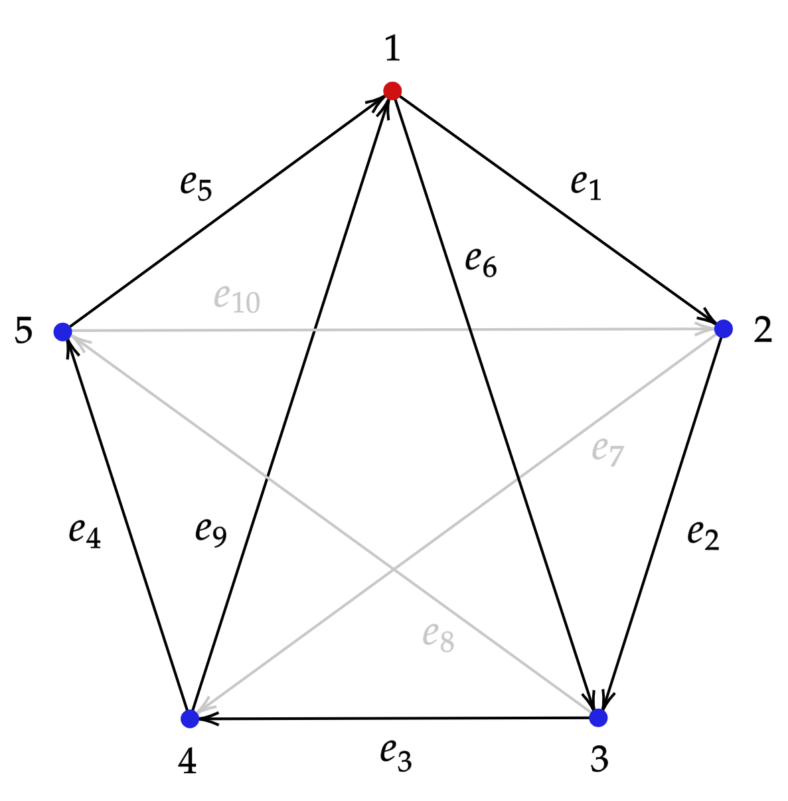
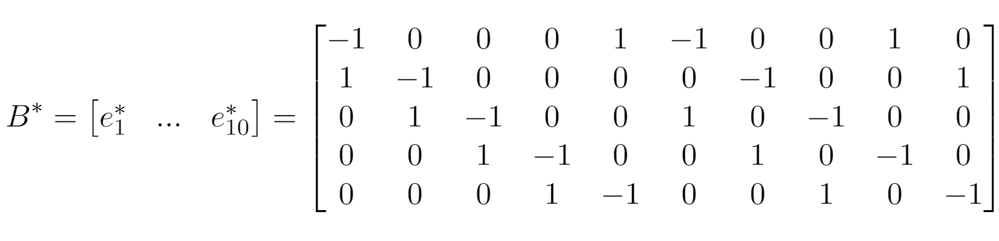
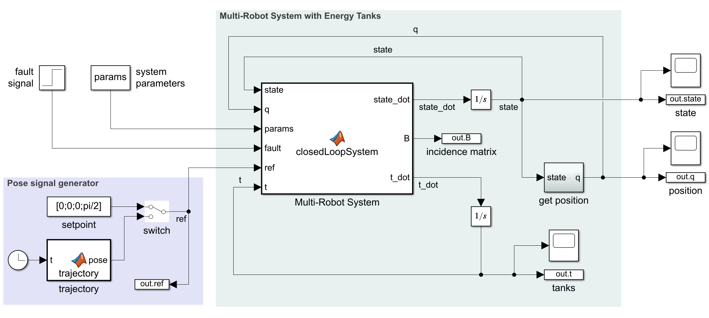
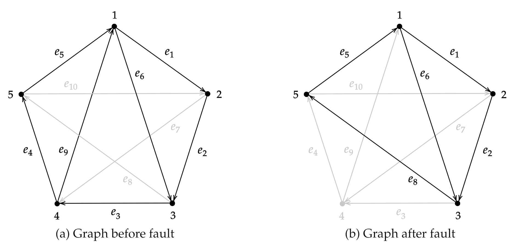
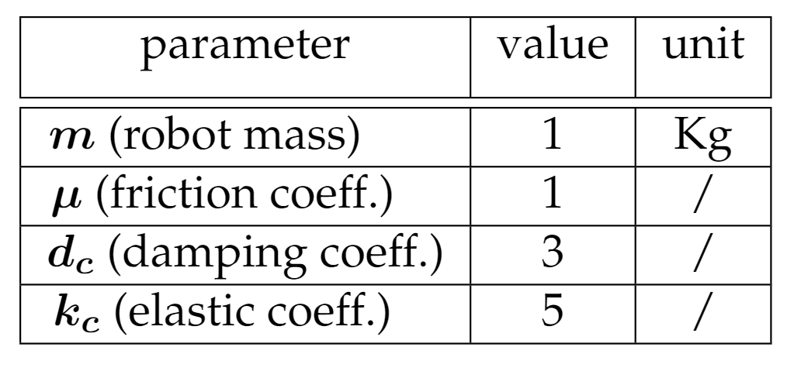
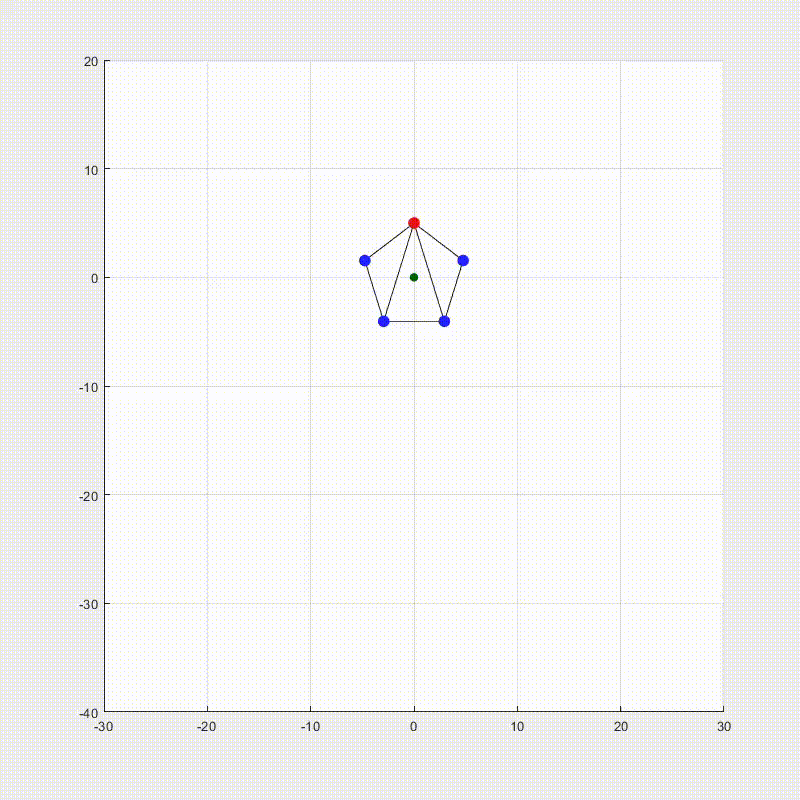
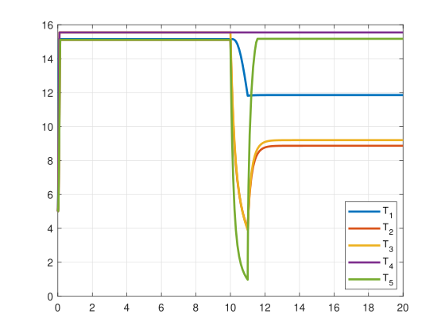
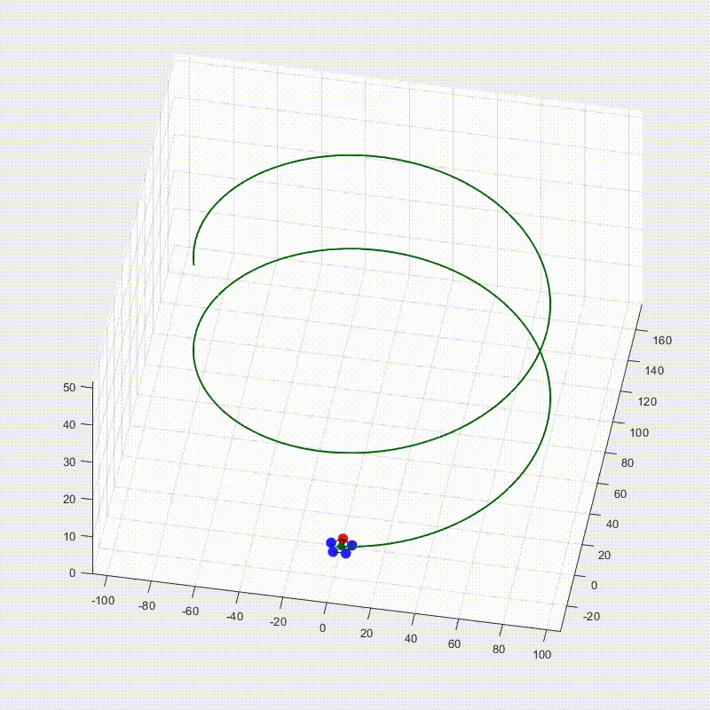
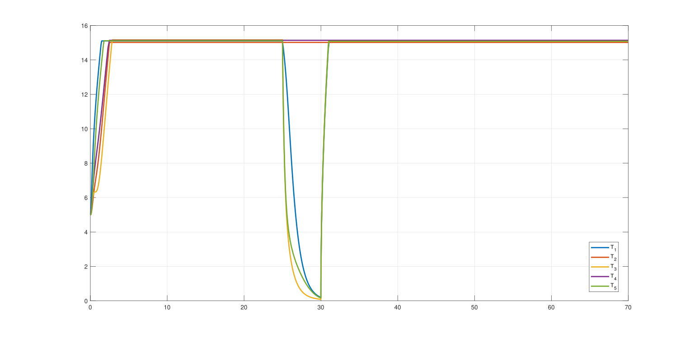
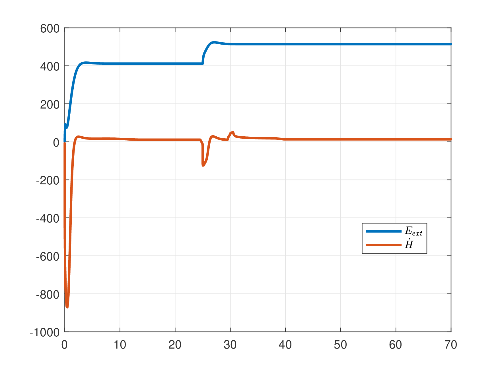

# Multi-Robot Systems: Fault-tolerant Formation Control using Energy Tanks
Formation control is a specific control problem within the broad class of coordination control. The main challenge in coordination control is to achieve a prescribed group behavior for a group of agents employing local feedback rules, rather than centralized controllers.For formation control, the prescribed group behavior is to achieve a geometrical shape forthe network of agents (i.e., to achieve a formation). Two other well-known types of coordinated control are consensus (or agreement) and synchronization. **Port-Hamiltonian** systems theory is an energy-based modeling framework that provides powerful tools for theanalysis and design of controllers by exploiting the physical structure of the system. The port-Hamiltonian framework considers systems as the interconnection of energy storing and energy dissipating components that exchange energy through power ports. External power ports enable the system to interact with external systems, such as controllers and the environment. Furthermore, the framework provides insight into the energy supplied by the controllers. 
In general, systems are subject to failures and, in the framework of multi-agent systems, it is important to achieve formation control even in case of faulty agents. The maingoal of this work is to implement a passivity-based reconfiguration strategy in case offaults of one agent. In particular, passivity will be preserved even in case of abrupt faults affecting some of the agents. This is done by exploiting the well-known concept of **energy tanks**, which allow the presence of an energy reservoir that can be exploited to supply the needed energy to maintain the reconfiguration of the system passive, especially in the case of join events between agents. This kind of technique is useful in various frameworks because in presence of a faulty agent the split of the malfunctioning agent can be easily implemented without perturbing the rest of the system that will autonomously reconfigure and keep performing the previously assigned task. 

**Expected results:**
<ol>
<li>Satisfactory regulation/tracking</li>
<li>Reconfiguration through split and join</li>
<li>Energy properly drained from tanks</li>
<li>Passivity of the overall system</li>
</ol> 

## Project overview
In this project a **follower-leader formation** has been considered. Leader apply a desired control input as the solution of a certain control task (regulation/tracking), while followers are linked to it by means of elastic couplings. The complete graph is stored in terms of an incidence matrix havin N (number of robots) rows and E (number of edges) columns. Further details can be found in the reference papers as well as in the source code itself.

The overall multi-robot system with energy tanks has been implemented in *Matlab R2021a* and *Simulink*. The *pose signal generator* in the bottom left of the Simulink scheme aims to generate the reference signal (as a [x y z theta] vector) for the follower. It follow the trajectory using a proportional control law, while the faulted robot try an emergency landing with a PD law. The fault instant is determined by a step signal, while the *params* block contains all the relevant constant parameters of the multi-robot system. The central block, *ClosedLoopSystem*, contains all the closed-loop dynamics, as well as the Hamiltonian formulation and the fault-handling procedure (split and passive join).

 

## Simulations
Simulation has been performed over a 5-robots system aiming to achieve a pentagon formation.

Two main simuliations of interest will be reported. In both cases all robots are assumed to be equal (same dynamic parameters). The formation starts in static conditions. A settling time is scheduled after the fault event to facilitate the reconfiguration of the formation (it is not strictly necessary) 

 

 

### Set-point regulation
- Formation: pentagion with external edges of length 20
- Setpoint: [0; 0; 0; pi/2]
- Fault: 4-th robot at t=10s
- Settling time: 1s
- Controller gain: Kp=5

 System behaviour: 

  Energy Tanks: 

### Trajectory tracking
- Formation: pentagion with external edges of length 20
- Trajectory: elicoidal
- Fault: 4-th robot at t=25s
- Settling time: 5s
- Controller gain: Kp=20

 System behaviour: 

  Energy Tanks: 

   Passivity: 

  

## References
- Antonio  Franchi  et  al.  “Bilateral Teleoperation of Groups of Mobile Robots With Time-Varying Topology”. In:IEEE Transactions on Robotics28.5 (2012), pp. 1019–1033.DOI:10.1109/TRO.2012.2196304
- Vos, Ewoud et al. “Formation control in the port-Hamiltonian framework” (2015)
