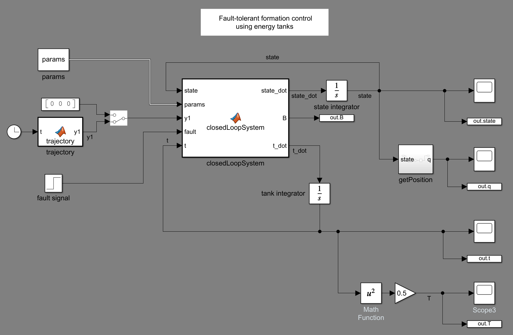
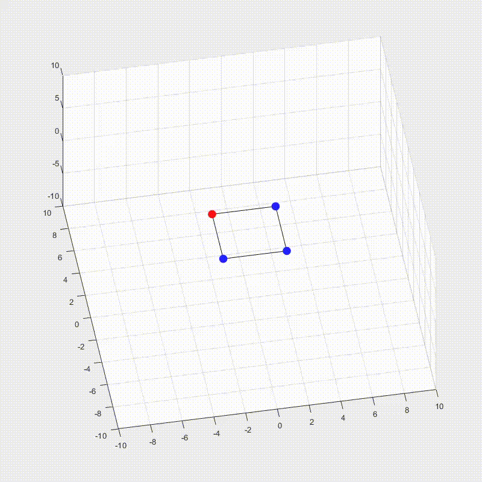

# Fault-tolerant formation control using energy tanks

- [x]  Formation control for 2 point masses on a R^2
- [x]  Paramentric symbolic formation control for N point masses R^n
- [x]  Formation control for 4 point masses R^3
- [x]  Fault management (split and join)
- [x]  Energy Tanks
- [x]  Trajectory tracking
- [ ]  Improve potential function V(z)
- [ ]  Simulations
- [ ]  Report
 
  

### No Energy Tanks

### with Energy Tanks

