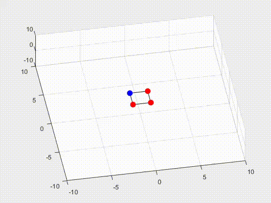

# Formation control in the port-Hamiltonian framework

- [x]  Formation control for 2 point masses on a R^2
- [x]  Paramentric symbolic formation control for N point masses R^n
- [x]  Formation control for 4 point masses R^3
- [ ]  Fault management
- [ ]  What else?

  

